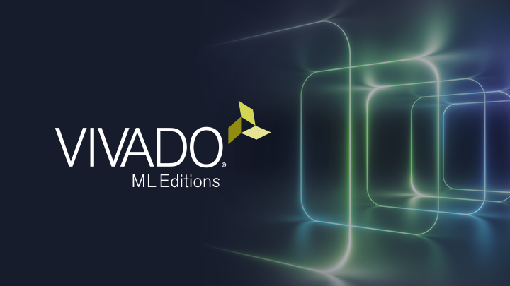

# Digital Logic Design with Verilog HDL

A comprehensive collection of digital circuit implementations exploring combinational and sequential logic. This repository documents my practical application of various modeling styles and serves as a portfolio for my VLSI design journey.

## 🚀 Project Overview
This repository features circuits implemented using three primary levels of abstraction:
* **Gate-Level Modeling:** Structural descriptions using primitive gates.
* **Dataflow Modeling:** Using continuous assignments (`assign` statements).
* **Behavioral Modeling:** High-level algorithmic descriptions using `always` blocks.

## 🛠️ Contents

### 1. Combinational Circuits
* Basic Logic Gates (AND, OR, NOT, XOR, etc.)
* Adders & Subtractors (Half/Full)
* Multiplexers & De-multiplexers
* Encoders & Decoders
* Arithmetic Logic Units (ALU)
* Comparators
* 4-Bit Magnitude Comparator

### 2. Sequential Circuits
* Latches and Flip-Flops (SR, D, JK, T)
* Shift Registers (SISO, SIPO, PISO, PIPO)
* Counters (Synchronous, Asynchronous, Up/Down)
* Finite State Machines (FSM) - Moore & Mealy Models

### 3. HDLBits Solutions
* Organized by topic (Verilog Language, Circuits, Verification).

## 🧪 Simulation & Verification
All modules are accompanied by a testbench to verify functional correctness. 
* **Tools used:** [Vivado] 
* **Waveform Viewer:** [Vivado]

## 📈 Learning Goals
* Mastering Verilog syntax and hardware timing.
* Transitioning from combinational logic to complex sequential machines.
* Preparing for physical design engineering roles in the VLSI industry.
